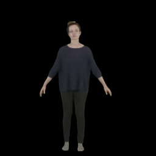
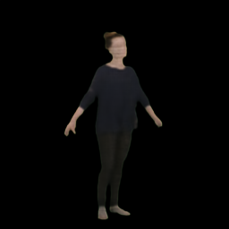
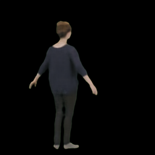
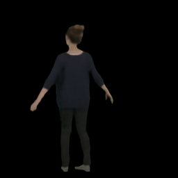
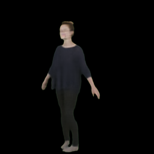

# Vertex2Image
 
Published on ACM Conference on Intelligent User Interfaces (ACM IUI) 2023

This project is based on the SMPL and UNet++ model to construct a targeted human figure. Vertex2Image uses SMPL vertices' spatial information to collect color and motion information. Vertex2Image is presenting a human figure model, not constructing an actual human model. With a given camera direction, we can determine which vertices are in the scene, then feeding the vertices' information into the model to present what the scene should look like. The biggest advantage we have over other models is the training speed. The model only needs 2 hours of trianing to construct high fidelity human figures.

Folder structure: \
Vertex2Image \
&emsp | checkpoint \
&emsp &emsp | data \
&emsp &emsp &emsp | person_1 \
        -- -- -- images_256by256   (ground truth images) \
        -- -- -- color_inputs.json (color information) \
        -- -- -- vert_rot.json     (joint rotation information) \
        -- -- -- camera.pkl        (camera parameters) \
        -- -- person_2 \
        b\
        -- -- person_n \
        b\
    -- output \
    -- .py files .....

Output from Vertex2Image model:
    

 
To run the model, just run "py train.py". If you want to customize to your dataset, the prerequisit steps are extracted images from videos and SMPL information (vertices and joint rotation). It is not neccessary to extract images because you can easily modify the code and run directly with a video source. If you use CV2, make sure to convert the image to RBG format before feeding the frames into the model. I may implement the video input method in the future.

The requirements.txt does not include torch package. Any 1.XX version of Pytorch works with the code. If you do not want to train on GPU, just set "CUDA = False" in the train.py file.